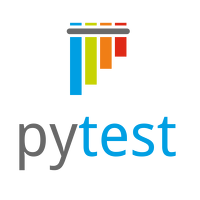

# grpc_test

## Автотесты на Python по проекту Niffler


<details>


- [Spring Authorization Server](https://spring.io/projects/spring-authorization-server)
- [Spring OAuth 2.0 Resource Server](https://docs.spring.io/spring-security/reference/servlet/oauth2/resource-server/index.html)
- [Spring data JPA](https://spring.io/projects/spring-data-jpa)
- [Spring Web](https://docs.spring.io/spring-framework/docs/current/reference/html/web.html#spring-web)
- [Spring actuator](https://docs.spring.io/spring-boot/docs/current/reference/html/actuator.html)
- [Spring gRPC by https://github.com/yidongnan](https://yidongnan.github.io/grpc-spring-boot-starter/en/server/getting-started.html)
- [Spring web-services](https://docs.spring.io/spring-ws/docs/current/reference/html/)
- [Apache Kafka](https://developer.confluent.io/quickstart/kafka-docker/)
- [Docker](https://www.docker.com/resources/what-container/)
- [Docker-compose](https://docs.docker.com/compose/)
- [Postgres](https://www.postgresql.org/about/)
- [React](https://ru.reactjs.org/docs/getting-started.html)
- [GraphQL](https://graphql.org/)
- [Thymeleaf](https://www.thymeleaf.org/)
- [Jakarta Bean Validation](https://beanvalidation.org/)
- [Jakarta JAXB](https://eclipse-ee4j.github.io/jaxb-ri/)
- [JUnit 5 (Extensions, Resolvers, etc)](https://junit.org/junit5/docs/current/user-guide/)
- [Retrofit 2](https://square.github.io/retrofit/)
- [Allure](https://docs.qameta.io/allure/)
- [Selenide](https://selenide.org/)
- [Selenoid & Selenoid-UI](https://aerokube.com/selenoid/latest/)
- [Allure-docker-service](https://github.com/fescobar/allure-docker-service)
- [Java 21](https://adoptium.net/en-GB/temurin/releases/)
- [Gradle 8.6](https://docs.gradle.org/8.6/release-notes.html)
- [GHA](https://docs.github.com/en/actions)
</details>


###  Используемые технологии
<p align="center">
  <code></code>
  <code></code>
  <code></code>
  <code></code>
  <code></code>
  <code></code>
</p>

## Как запустить
```
Перейти в каталог python_test:
cd python_test
```
```
В консоли выполнить команду:
pytest --alluredir=[your_path_for_report] --clean-alluredir ./test
```
## Локально, на хосте

Перед выполнением необходимо:
* Создать файл .env в директории python_test и определить в нем параметры конфигурации (пример в .env.sample):
    - FRONTEND_URL
    - GATEWAY_URL
    - AUTH_URL
    - AUTH_SECRET
    - SPEND_DB_URL
    - USERDATA_DB_URL
    - TEST_USERNAME
    - TEST_PASSWORD
    - KAFKA_ADDRESS
    - SOAP_ADDRESS
    - GRPC_HOST
